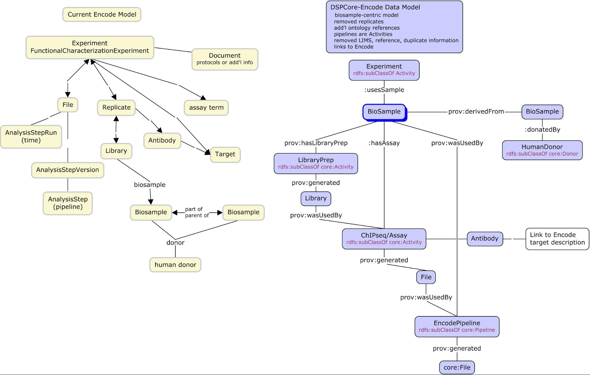
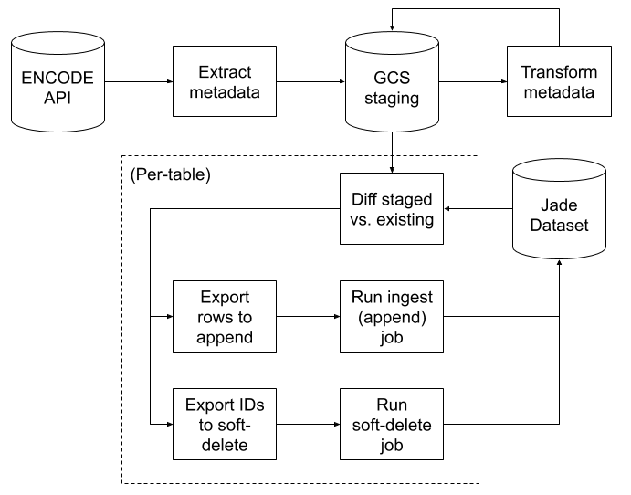
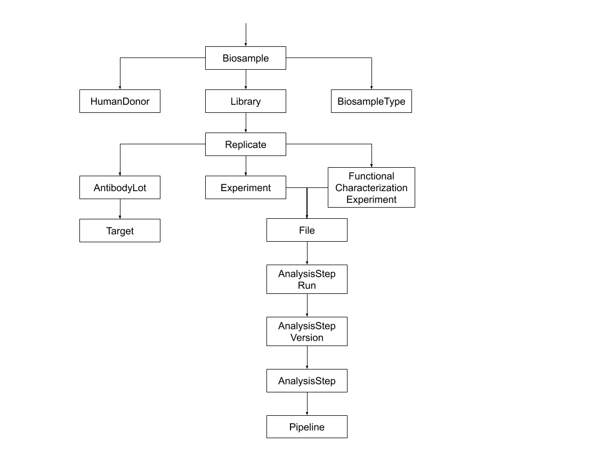
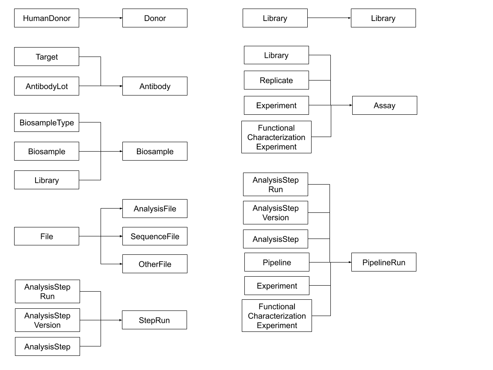

# ENCODE Ingest
Batch ETL pipeline to mirror ENCODE data into the Terra Data Repository (TDR).

## Schema Design
The schema used for this dataset was almost entirely inspired by the Terra
Interoperability Model (TIM). JSON definitions of the resulting tables can be
found under [`schema/`](./schema). The schema is purposefully very different
from the source ENCODE schema: it is sample-centric (instead of experiment-centric),
merges & splits ENCODE entities as needed, and does not attempt to capture all
of the information published in the source data.

## Pipeline Architecture
The ingest pipeline is orchestrated through Argo, with most data processing logic
delegated to Dataflow and BigQuery. The high level flow looks like:

NOTE: Only metadata ingest is implemented. The system still needs to be extended
to ingest data files from ENCODE's S3 archives.

### Extracting Metadata
Metadata extraction is the first step of ENCODE ingest. The extraction component is
written as a Dataflow pipeline, which begins by querying the metadata of all Biosample
entities from human donors. From there, the pipeline traverses known foreign-key
fields to scrape the rest of the metadata we care about:

Some important things to note:
1. The initial query relies on there being relatively few Biosample entities in ENCODE's
   system, as they all must be returned in a single response payload. Performance may
   degrade as ENCODE continues to grow.
2. The links we follow between different entity types were chosen based on non-scientific
   experimentation and performance-testing. If the number of entities in a type grows
   significantly, performance migth degrade / the pipeline might crash.

### Transforming Metadata
Metadata transformation is also implemented as a Dataflow pipeline. Instead of one large
DAG, this step can be viewed as a collection of tiny processing trees that just happen to
run at the same time:

Note that some raw entities are used to contribute to multiple output tables.
